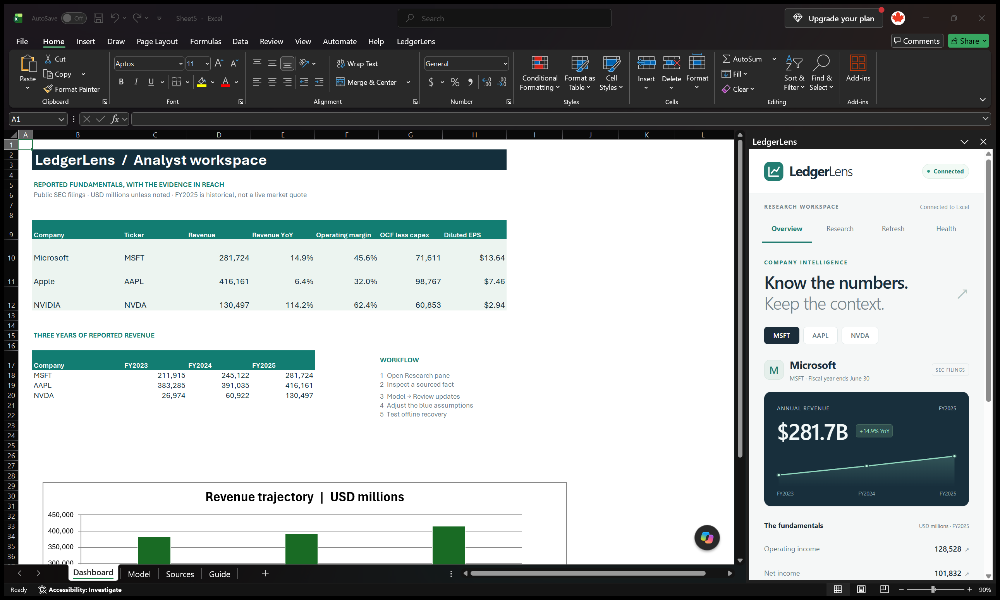

# LedgerLens

**A sourced financial research workspace inside Microsoft Excel**, using public SEC filings and optional OpenAI research.



The workflow is simple: inspect a financial fact, follow its filing evidence, research a company, preview nine historical model updates, and apply them without overwriting analyst assumptions or forecast formulas. Every reviewed import appends a durable source audit to the workbook. Undo checks for subsequent edits before restoring values.

## Run the Windows release

1. Extract the entire `LedgerLens-1.1.0-windows.zip` into a writable local folder.
2. Double-click **Start LedgerLens.cmd**. It starts the local service and opens a new analyst workbook with the research pane.
3. On **Model**, choose **LedgerLens → Review updates**, preview the nine reported values, then apply. Change the blue assumptions to explore forecasts.
4. Use **Research** for cited explanations and **Health** to inspect SEC requests, manage offline mode, and check notifications.

Windows desktop Excel, .NET Framework 4.8, and Microsoft Edge WebView2 Runtime are required. The service runtime is included; Visual Studio, Node, and the .NET SDK are unnecessary for running the release. The validated host is Microsoft 365 Excel x64, version 16.0, Application.Build 20430. The native add-in is unsigned. If your organization's policy blocks unsigned XLLs, use the browser preview or arrange an approved development environment; the launcher does not change Office security policy.

The existing user-level `OPENAI_API_KEY` is read locally by the service. Without a key, the app provides explicitly labeled calculated analysis. Use OpenAI is an explicit option; `LL.ASK` also requests AI and may incur usage charges. No key is included in the workbook, source, or release. See [setup and troubleshooting](docs/OPERATIONS.md).

```powershell
.\Start-LedgerLens.ps1 -Browser -NoExcel  # Browser preview
.\Start-LedgerLens.ps1 -Validate          # Real Excel launch/save/close check
.\Stop-LedgerLens.ps1                     # Stop service; leave workbooks open
```

## Features

- C# Excel-DNA add-in with asynchronous formulas, a ribbon, and a WebView2 research pane.
- Three companies, three fiscal years, and nine financial metrics, with links to SEC filings.
- Reviewed model updates, edit conflict checks, source audit, and guarded undo.
- Offline snapshots and explicit SEC sync with bounded HTTP retries, deadlines, and a circuit breaker.
- Optional AI explanations with source citations, plus calculated analysis that needs no API key.
- Shared browser UI and an Office.js adapter preview.

Example formulas:

```excel
=LL.METRIC("MSFT","Revenue","FY2025")
=LL.SOURCE("MSFT","Revenue","FY2025")
=LL.STATUS("MSFT","Revenue","FY2025")
=LL.TABLE("AAPL","FY2025")
=LL.ASK("MSFT","Compare FY2024 and FY2025 operating margins")
=LL.LIVE()
```

`LL.METRIC` returns USD millions, except `DilutedEPS` in USD/share. `LL.TABLE` returns an array; spill behavior depends on the Excel version. `LL.LIVE` displays service notifications, not security prices. Optional formula revision arguments allow explicit refresh without volatile UDFs.

## Documentation

- [Setup and troubleshooting](docs/OPERATIONS.md)
- [Architecture and design decisions](docs/ARCHITECTURE.md)
- [Office.js preview](docs/OFFICE-PREVIEW.md)
- [Data provenance](docs/DATA.md)

This is an independent portfolio project, not an AlphaSense product. Enterprise SSO, AWS deployment, signed installation, and managed updates are not implemented. Windows Microsoft 365 Excel x64 has been tested; older Excel and actual Mac/Office.js hosts have not. The project was developed with AI assistance.

## Build and test

The source package includes .NET and npm dependency lockfiles. Use the x64 .NET SDK pinned by `global.json`, Node 22+, and Windows PowerShell 5.1. Edge is used by Playwright.

```powershell
npm ci
.\build.ps1 -SelfContained
.\Start-LedgerLens.ps1 -NoExcel
.\scripts\test.ps1
# Real Excel/WebView2 integration, run separately from service load tests:
.\scripts\test.ps1 -Native
.\scripts\package.ps1
.\scripts\test-release.ps1  # Fresh extraction, real Excel launch, saved formula inspection
```

The standard suite covers .NET contracts, SEC transport failures, the HTTP service, the browser UI, and the mocked Office.js adapter. It requires neither an OpenAI key nor the original SEC downloads. Optional reconciliation against archived SEC responses is described in [data provenance](docs/DATA.md).

The native test starts and closes its own Excel instance. Network delays come from a test-only proxy, allowing repeatable responsiveness and workbook-close cancellation checks without artificial behavior in the service. Run service load tests separately from native tests. Test results stay under `artifacts/test-results` and are excluded from release packages.

Packaging requires a self-contained build and produces Windows and source ZIPs. The Windows package includes runtime dependencies, documentation, and the financial snapshot; the launcher creates a new workbook.
