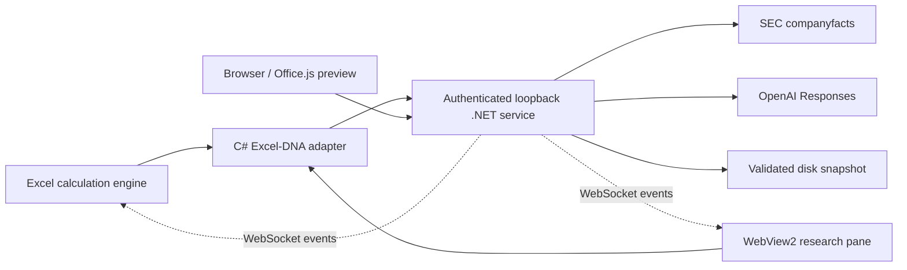

# Architecture and decisions

## Native boundary

`LedgerLens.Excel` targets .NET Framework 4.8. Excel-DNA supplies XLL registration, asynchronous calculation, observable RTD integration, ribbon, and task panes. The implementation uses explicit `RunTaskWithCancellation` registration: an earlier optional-parameter registration did not cancel when a workbook closed, and the real-host regression test caught it. COM reads and writes run on Excel's main thread through `QueueAsMacro`. Network operations never use COM. See [Excel-DNA's async guidance](https://excel-dna.net/docs/guides-advanced/performing-asynchronous-work/).

The task pane marshals WebView2 calls back to its UI thread after asynchronous work. Panes belong to Excel windows, and a command must still target the active owning window before it can write. Closing a pane cancels queued work. Disposal is idempotent across Excel's callbacks and explicit test shutdown.

Queued workbook commands have a 25-second deadline. `QueuedAction` makes cancellation atomic with the start of synchronous execution: an expired queued command cannot write later, and a write that has begun reports its actual outcome. The pane retains its service origin independently of the service singleton so late teardown callbacks do not access a disposed client. WebView2 profiles live inside each release's private runtime folder.

Inside the add-in, RCWs are left to the runtime; manual `ReleaseComObject` can invalidate shared references. The separate PowerShell automation process explicitly releases its own COM references and unloads via Excel's AddIns manager. This distinction follows [Excel-DNA COM guidance](https://excel-dna.net/docs/guides-basic/excel-programming-interfaces/using-the-excel-com-automation-interfaces/).

Excel-DNA was selected because this demonstration centers on C# UDFs and calculation behavior. It is not a VSTO implementation. Core contracts, refresh planning, and the service are reusable by a future VSTO adapter. A separate Office.js bridge demonstrates a cross-platform UI seam without claiming native feature parity.

## Model updates

`RefreshPlanner` creates a plan for reported-value cells only. It records original content, workbook identity, company, metric mapping, period, and previous imported company. Application rechecks those dependencies and every target. An edit after preview invalidates the transaction. Protected, merged, read-only, or unexpected targets fail before writes.

`WorkbookActions` captures each value before changing it. The reported numbers, imported-company marker, and full evidence audit form one transaction. Exceptions trigger restoration; Excel calculation mode, events, and screen updating are restored in `finally`. Rollback checks the post-apply values, including the appended audit, before undoing. Later analyst-input edits survive. The last transaction is retained only for the current session; the source audit is saved with the workbook.

Changing company after import makes forecast formulas blank until another reviewed import establishes matching company context. This prevents mixing one issuer's imported actuals with another issuer's forecasts.

Each open workbook object receives an independent session ID. The saved document GUID alone is insufficient because Excel's Save Copy preserves it. Closing a copy therefore cannot clear the original's pending preview or undo history. Already-current historical cells remain preview dependencies, so editing them after preview also blocks the transaction.

## Service and resilience

The ASP.NET service runs outside Excel, avoiding provider failures inside the host process. The immutable-by-convention financial snapshot is atomically swapped after validating a whole sync batch; disk persistence uses a temporary file and atomic replacement. A failed batch never partially changes the catalog.

Both client and service have bounded, time-limited caches. In-flight calls coalesce by normalized key. Caller cancellation releases its waiter, while a shared load can complete for other cells. Clearing a cache advances a generation so old requests cannot repopulate it. Service provider concurrency is four, timeout eight seconds, with two bounded retries. Three failed logical calls open the circuit for eight seconds, followed by one half-open probe. Generation leases prevent old failures from reopening a circuit after a mode change. The fact provider normally serves the validated snapshot; live SEC acquisition is an explicit sync action.

WebSocket subscribers have bounded queues and deterministic cleanup. Both the browser and native observable reconnect with backoff. Events are notifications; a demo replay never mutates reported financial facts. This feed is not an event-sourced ledger and does not guarantee durable delivery of every disconnected event.

## AI and trust

The service sends the question and the selected company's 27 public facts to the [OpenAI Responses API with structured outputs](https://developers.openai.com/api/docs/guides/structured-outputs). It does not upload workbook contents. Claim citations must be from the supplied source IDs. Timeouts, refusals, rejected keys, and malformed JSON produce sanitized errors. AI concurrency is two, the request budget is 30 uncached calls per service session, timeout is 75 seconds, and the 64-entry response cache lasts six hours. The default model is `gpt-5-mini`; `LEDGERLENS_AI_MODEL` can override it, subject to API compatibility.

Schema and citation validation do not prove numerical truth or that a cited record supports a sentence. The UI exposes evidence for review. The deterministic fallback computes growth, margins, and operating cash flow less capex directly from financial facts and is labeled calculated analysis.

API requests require a random per-process bearer token. HTTP binds only to 127.0.0.1, validates Host and Origin, and limits request bodies. WebSocket authentication uses a subprotocol. Browser bootstrap uses a URL fragment that is removed after startup. The launcher restricts the runtime folder's ACL to the Windows user. This is local session authentication, not enterprise SSO; other programs running as the same account remain in the trust boundary. Keys stay in user/process environment configuration and are not logged or embedded in workbooks.

## Production path

The prototype intentionally leaves enterprise authentication, entitlements, signing, managed updates, AWS hosting, telemetry export, and proxy certification unimplemented. A production migration would first formalize provider contracts and entitlements, then add a brokered OAuth flow and short-lived tokens, followed by signed installers, staged update rings, rollback, compatibility testing, and privacy-aware diagnostics. SAML would normally terminate at an identity broker rather than be implemented inside a formula.

The Windows XLL is inherently platform-specific. The Office.js preview inserts sourced values and exports research; it does not implement custom functions or transactional model refresh. Cross-platform feature parity requires a separate implementation and actual host tests, not merely a valid manifest.
